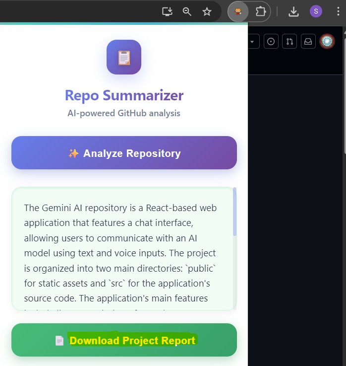

# GitHub Repository Summarizer Chrome Extension 🚀

A professional Chrome/Edge extension that provides instant, AI-powered summaries and documentation for any GitHub repository. Get a concise overview and a detailed project report with just one click.

## 🌟 Features

- **Instant Repository Summary**: Get a clear, focused summary of any GitHub repository  
- **One-Page Project Documentation**: Automatically generate comprehensive documentation  
- **AI-Powered Analysis**: Uses Groq's LLM for intelligent content generation  
- **Clean & Modern UI**: Intuitive interface with a professional design  
- **Cross-Browser Support**: Works seamlessly on Chrome and Edge  


### Screenshots

#### Popup Interface

*The main extension popup interface*

#### How to Unpack the Extension


*Step-by-step guide to loading the extension in Chrome/Edge*

## 🛠️ Technical Architecture

### Frontend (Chrome Extension)
```
chrome-extension/
├── manifest.json     # Extension configuration
├── popup.html        # Popup interface
├── popup.js          # UI logic and API communication
├── content.js        # GitHub page interaction
├── background.js     # Service worker (future use)
└── styles.css        # Modern UI styling
```

### Backend (Vercel Serverless)
```
api/
└── index.py          # FastAPI serverless endpoint
```

## 🔧 Technology Stack

- **Frontend:**
  - Vanilla JavaScript  
  - Chrome Extensions API  
  - Modern CSS3  

- **Backend:**
  - Python 3.12+  
  - FastAPI  
  - Groq AI API  
  - Vercel Serverless Functions  

## 📦 Installation

1. **Clone the repository:**
   ```bash
   git clone https://github.com/srivatsavavuppala/xtension.git
   ```

2. **Load the extension:**
   - Open Chrome/Edge  
   - Go to Extensions (`chrome://extensions/`)  
   - Enable **Developer Mode**  
   - Click **"Load unpacked"**  
   - Select the `xtension` folder  

3. **Backend setup (for development):**
   ```bash
   cd api
   pip install -r requirements.txt
   uvicorn index:app --reload
   ```

## 🚀 Deployment

### Frontend (Chrome Web Store)
- Package the extension  
- Submit to the Chrome Web Store  
- Await review and publication  

### Backend (Vercel)
- Already deployed at: `https://xtension-git-main-srivatsavavuppalas-projects.vercel.app/api/index`  
- Automatically deploys from the main branch  
- Environment variables managed via the Vercel dashboard  

## 🔑 Environment Variables

Required environment variables in Vercel:
- `API_KEY`: Your Groq API key  

## 🎯 Usage

1. Visit any GitHub repository  
2. Click the extension icon  
3. Click **"Summarize This Repo"**  
4. View the instant summary  
5. Download the detailed project paper  

## 🛡️ Security

- API keys stored securely in Vercel  
- CORS protection implemented  
- No sensitive data stored locally  
- Secure communication with Groq API  

## ⚡ Performance

- Instant UI feedback  
- Efficient API calls  
- Minimal resource usage  
- Optimized content processing  

## 🔜 Future Enhancements

- Dark mode support  
- Custom summarization options  
- Batch repository analysis  
- Export in multiple formats  
- Repository comparison feature  

## 🤝 Contributing

1. Fork the repository  
2. Create your feature branch:
   ```bash
   git checkout -b feature/amazing-feature
   ```
3. Commit your changes:
   ```bash
   git commit -m 'Add amazing feature'
   ```
4. Push to the branch:
   ```bash
   git push origin feature/amazing-feature
   ```
5. Open a Pull Request  

## 📝 License

This project is licensed under the MIT License - see the [LICENSE](LICENSE) file for details.

## 👥 Authors

- [Srivatsava Vuppala](https://github.com/srivatsavavuppala)

## 🙏 Acknowledgments

- Groq API for AI capabilities  
- FastAPI for efficient backend  
- Vercel for serverless hosting  
- GitHub for inspiration  

---

Made with ❤️ and ☕
